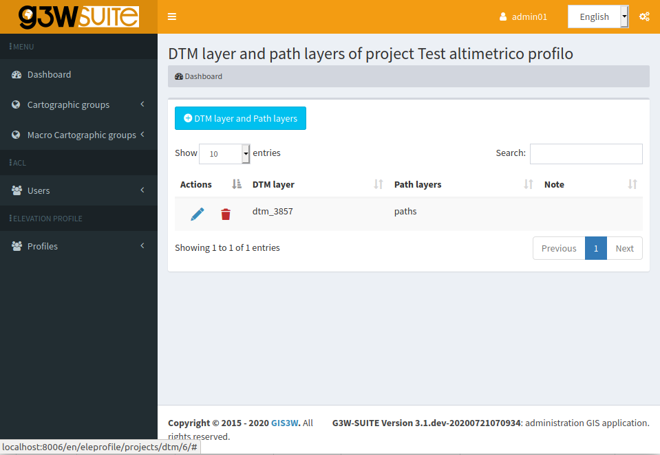
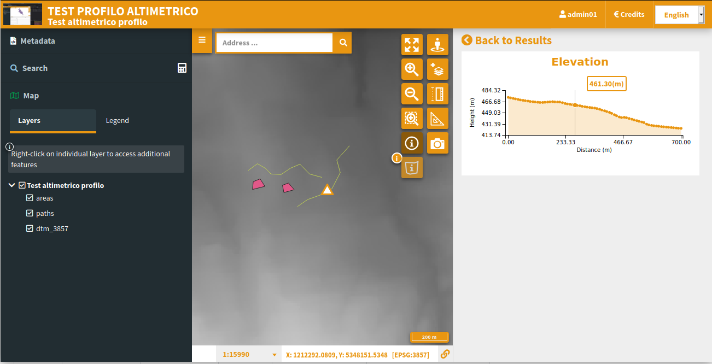

# G3W-ADMIN-ELEVATION-PROFILE

Gived a DTM raster layer calculate for every feature of a LineString layer the elevation profile and show on client.



 

###Requirements
G3W-SUITE > v3.0

Installation
------------

Add like git submodule from main g3w-admin directory

```bash
gti clone https://github.com/g3w-suite/g3w-admin-elevation-profile.git
mv g3w-admin-elevation-profile <path_to_g3w_location>/g3w-admin/eleprofile
```

Add *eleprofile* module to G3W_LOCAL_MORE_APPS config value inside local_settings.py:

```python
G3WADMIN_LOCAL_MORE_APPS = [
    ...
    'eleprofile',
    ...
]
```


Apply migrations:

```bash
    ./manage.py migrate eleprofile
```

